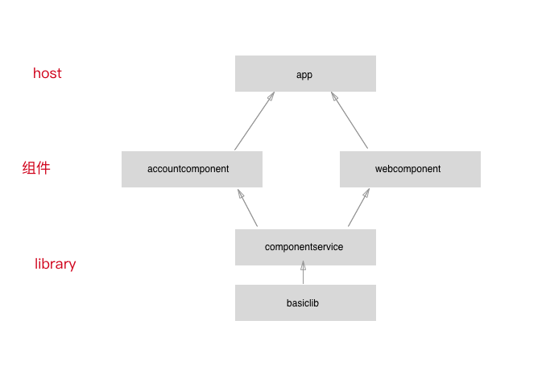

# 工程结构介绍

- `basiclib` 基础库
- `componentservice` 服务接口定义、路由定义
- `accountcomponent` `webcomponent` 业务组件，相互独立，通过修改 gradle.properties 切换 library 和 application 
- `app` 主工程 host，开发期间不直接依赖子组件，通过接口或者路由的方式与组件交互

