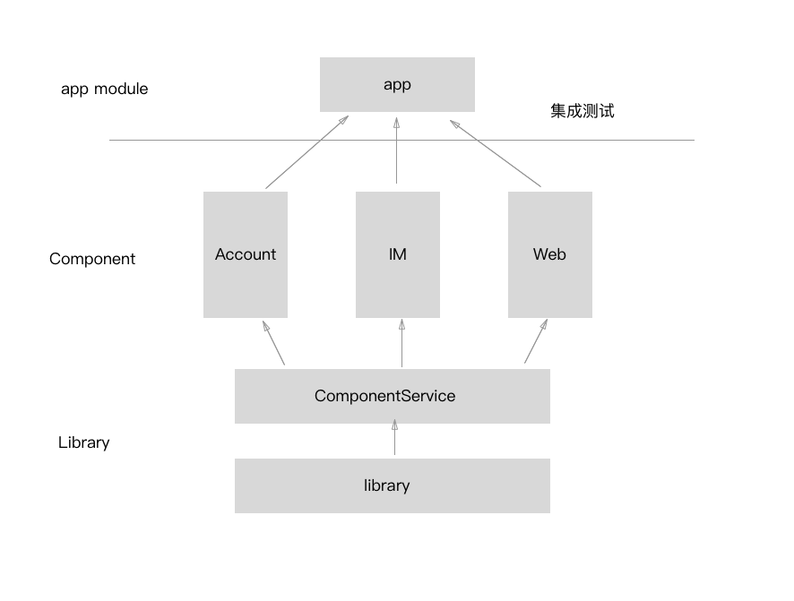

# 组件化方案介绍

## 一. 什么是组件化

组件，可以简单理解为独立的功能模块，所以，对于项目来说，组件化就是将项目拆分成多个相互独立的功能模块。
组件化的核心思想是分而治之，解耦分层。

## 二. 为什么要使用组件化

1. 极大地缩短编译时间。理想的组件化是，开发阶段，按需编译，每个组件只依赖最小的依赖库（如基础 UI 类、基础样式、基础工具类以及网络库等），这样编译速度会快很多。
2. 并行开发。因为组件相互独立， 人员多的团队可以实现并行开发，极大地提高开发效率
3. 测试更加高效。对于业务复杂，代码耦合严重的项目，每个改动都需要进行大范围的回归测试。而组件化之后，只需要对修改的组件进行测试即可。

## 三. 如何实现组件化

要实现组件化，主要考虑一下几个方面：

- 代码解耦。如何将一个庞大的工程拆分成有机的整体？

- 组件单独调试。每个组件都是一个完整的整体，如何让其单独运行和调试呢？

- 数据传递。因为每个组件都会给其他组件提供的服务，那么主项目（Host）与组件、组件与组件之间如何传递数据？

- UI跳转。UI跳转可以认为是一种特殊的数据传递

- 集成调试。在开发阶段如何做到按需的编译组件？一次调试中可能只有一两个组件参与集成，这样编译的时间就会大大降低，提高开发效率。

- 代码隔离。如何从根本上避免组件之间的直接引用呢？只有做到这一点才是彻底的组件化。

### 1. 代码解耦

Android Studio 工程支持多 module。我们对两种 module 进行区分

- 基础库 library，这些代码被其他组件直接引用。如网路库、图片加载库、常用工具类等

- Component（组件），这种 module 是一个完整的功能模块。比如 IM模块、用户模块等

将 library 称之为依赖库，Component 称为组件，而负责拼装这些组件的形成完整 app 的 module，称之为主项目或主 module 或 app module

### 2. 组件单独调试

要实现单独调试需要对组件 module 做一些修改：

1. 修改组件的 `build.gradle` 把 `apply plugin: 'com.android.library'` 换成 `apply plugin: 'com.android.application'`

2. 新建一个 AndroidManifest，增加入口 Activity

3. 为了避免组件资源冲突，在组件的 `build.gradle`中增加 `resourcePrefix xxx_`，从而固定每个组件的资源前缀。 

### 3. 数据传递 和 UI 跳转

主项目和组件、组件与组件之间不能直接使用类的相互引用来进行数据交互。那么如何做到这个隔离呢？
可以采用接口+实现的结构。每个组件声明自己提供的服务Service，这些Service都是一些抽象类或者接口，
组件负责将这些Service实现并注册到一个统一的路由Router中去。要使用某个组件的功能，只需向Router
请求这个Service的实现，具体的实现细节我们全然不关心，只要能返回我们需要的结果就可以了。

数据传递和 UI 跳转我们使用 ARouter 这个三方库实现。具体可参看 ARouter 介绍

### 4. 集成调试

在开发后期我们需要把几个组件机集成到一个app里面去验证。由于我们上面的机制保证了组件之间的隔离，
所以我们可以任意选择几个组件参与集成。这种按需索取的加载机制可以保证在集成调试中有很大的灵活性，
并且可以加大的加快编译速度。

### 5. 代码隔离

最终的集成测试还是需要在 app module 引入各个组件的依赖，我们可以通过编写 gradle 插件，
在编译期间引入依赖，以避免由于人为因素导致的直接依赖实现类的问题。

